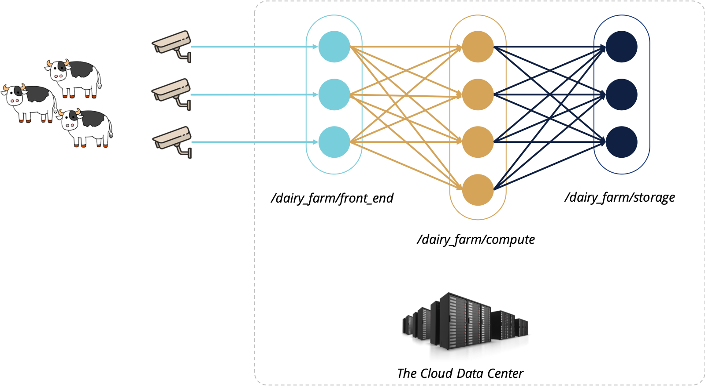

*Important: you need several packed model files to run this demo, which is not available for distribution at this moment. We might share it later. Please contact [me](mailto:songweijia@gmail.com) for more details.*

The Dairy Farm demo shows how to build a cattle health surveillance application using Cascade. A typical dairy farm milks the dairy cows twice a day using a voluntary milking system (VMS), where a camera installed at the entry of VMS captures the images of every cow that walks in. The camera streams the video to a data center that will identify each cow and give a health score. Our demo application incorporates three ML models to achieve this goal. A filter model detects whether a video frame contains a cow or not; a cow identification model identifies the cow in a frame; a health evaluation model gives a health score based on the cow image. Please note that the live video from the camera is generally protected and preprocessed in the edge cloud. The edge cloud sends filtered frames to a central cloud system. Here we use a simplified scenario to focus on the data center part.

# Prerequisite Concepts
Cascade organizes the objects in a file-system approach. The *objects* in a directory are of the same type and for the same purpose. An *object pool* is a container for all objects included in a directory and its subdirectories. The object pool metadata is placement information like the subgroup to store the objects and the sharding policy. *Cascade metadata service* manages that information for all object pools in the system. When a client access objects in an object pool, it retrieves and caches the object pool metadata to find the corresponding cascade server node. 

Please note that object pools do not nest.
If an object pool `/A/B/` exists, Cascade will refuse the creation requests for object pools like `/A/B/C/` or `/A/`. That is because object pool `/A/B/` has enforced the placement of the objects in `/A/B/` already. Allowing new placement information in `/A/` or `/A/B/C/` will cause ambiguity.

*User Defined Logic* or UDL is a codelet (binary or scripts) developed by an application programmer. A UDL can be registered to one or multiple directories in the Cascade file system. Once registered, putting an object in that directory or its subdirectories will trigger the registered UDL.

*Data Flow Graph* or DFG is a configuration file in JSON format. It specifies which UDLs are registered to which directories and where the output of the UDLs should go.

# Application components
<table>
  <tr align=center>
    <td></td>
  </tr>
  <tr>
    <td align=center>Figure 1. Dairy Farm Demo Architecture</td>
  </tr>
</table>

The above figure shows the architecture of this demo. The core of this architecture consists of three object pools. The `/dairy_farm/front_end` object pool locates in a transient subgroup (`TriggerCascadeNoStore<>`) because it does not store data. We attached a filter UDL to the `/diary_farm/front_end` object pool, which calls the filter model to detect if a cow is possibly in a video frame. If positive, the filter UDL relay the frame object to the computation tier, the `/dairy_farm/compute` object pool. The `/dairy_farm/compute` object pool locates in a volatile subgroup (`VolatileCascadeStore<>`). We attach a computation UDL to the `/dairy_farm/compute` object pool, which calls the cow identification model and a health evaluation model to identify the cow id and give a health score. The computation UDL sends the cow id and health score pair to the storage tier, the `/dairy_farm/storage` object pool, which stores the records in a persisted log.

Each of the object pools is mapped to subgroups sharded for performance and replicated for fault tolerance. Please check the [configuration file](../../../service/sample-derecho.cfg#L229) to see how to set up the subgroup layout.

# Build the Demo
The dairy farm demo is built along with Cascade if the following dependencies are installed and visiable to cmake. We also prepared a set of installation scripts for your convenience.
- ANN: A Library Approximate Nearest Neighbour Searching, [v1.1.2](https://www.cs.umd.edu/~mount/ANN/).
- libtorch [v1.8.1 cpu](https://download.pytorch.org/libtorch/cpu/libtorch-cxx11-abi-shared-with-deps-1.8.1%2Bcpu.zip), [v1.8.1 gpu](https://download.pytorch.org/libtorch/cu111/libtorch-cxx11-abi-shared-with-deps-1.8.1%2Bcu111.zip)
- lib tensorflow [v2.4.1 cpu](https://storage.googleapis.com/tensorflow/libtensorflow/libtensorflow-cpu-linux-x86_64-2.4.1.tar.gz), [v2.4.1.gpu](https://storage.googleapis.com/tensorflow/libtensorflow/libtensorflow-gpu-linux-x86_64-2.4.1.tar.gz)
- Tensorflow CPP API, [cppflow](https://github.com/serizba/cppflow.git), commit 9ea9519c66d9b1893e2d298db8aa1ee866f903a2.
- [OpenCV4](https://github.com/opencv/opencv/archive/master.zip)
You can follow the [scripts](../../../../scripts/prerequisites) to install the above dependencies. Please make sure the `INSTALL_PREFIX` variable is set to the directory you want to install and visible to cmake build system.

# Run the Demo
You need the packed model files to run this demo, which is not available for distribution at this moment. We might share it later. Please contact [me](mailto:songweijia@gmail.com) for more details.

We prepared a minimum environment you need to run the demo locally. In `<build-root>/src/applications/demos/dairy_farm/dairy_farm_cfg/`, you will find five folders: `n0`, `n1`, ..., `n4`, each of them contains a configuration for running a Cascade node (either server or client). You need a minimum of four nodes to start the Cascade service. In the following example, we use `n0` to `n3` for Cascade service, and use `n4` for the client.

## Start the cascade service.
You can start four terminal and change directory to `n0` to `n3`, respectively. In each of the terminal, issue command `run.sh server` to start the service. Once all nodes started, the Cascade service will load the dairy_farm application from [`dfgs.json`](dairy_farm/dfgs.json.tmp) and waiting for client requests. The `dfgs.json` file defines the DFGs for applications to be loaded in the Cascade service. We plan to adopt a dynamic loading approach in the future. 

## Run a simulated single frame camera.
We provide a simulated camera client at `<build-root>/src/applications/demos/dairy_farm/dairy_farm_client`. You run this client in `n4` to send a frame, which can be a JPEG or PNG file, to the dairy_farm application. Once the frame is sent, you can run `run.sh client` to start the normal interactive cascade client to check the objects in the application object pools: `/dairy_farm/compute` and `/dairy_farm_storage`.

## TODO: run a python-simulated camera.
